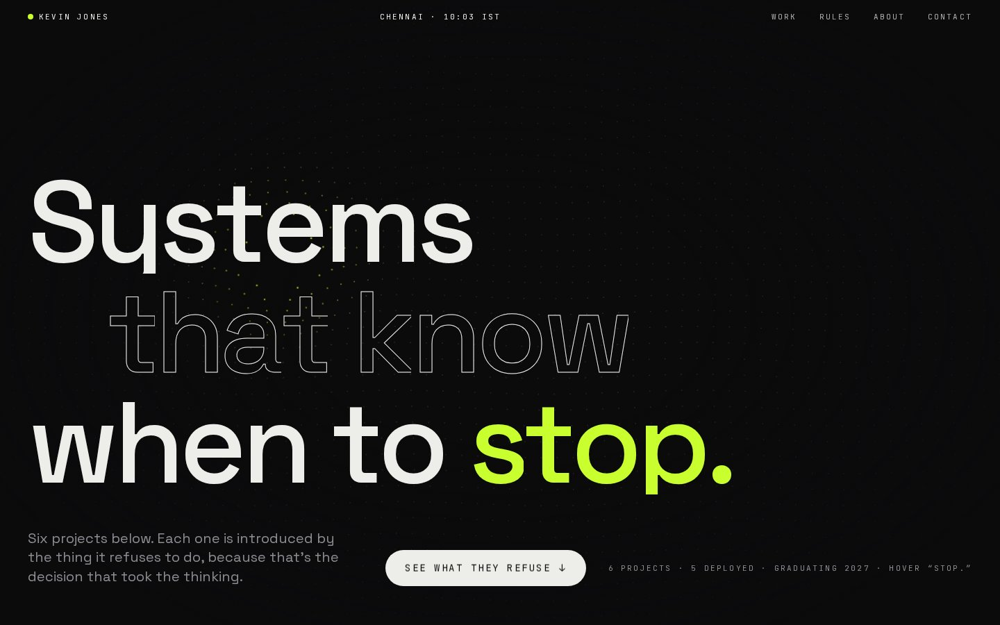
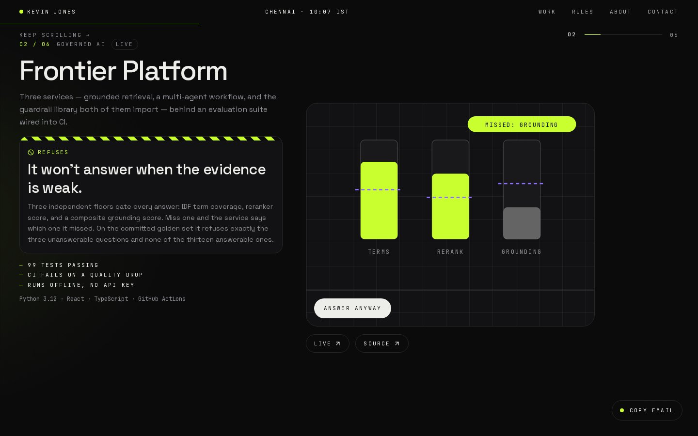

<div align="center">

# Portfolio — Kevin Jones

### Most portfolios list what the work does. This one leads with what it won't.

A personal site built around one argument: the interesting decision in a system
is the constraint, not the feature. Six projects, each introduced by the thing
it refuses to do.

### **[→ Open the live site](https://portfolio-website-eight-kappa-iwtiz3w2ef.vercel.app)**

`portfolio-website-eight-kappa-iwtiz3w2ef.vercel.app` · deployed on Vercel from `main`

[](https://portfolio-website-eight-kappa-iwtiz3w2ef.vercel.app)


[](https://portfolio-website-eight-kappa-iwtiz3w2ef.vercel.app)

</div>

---

## The idea

Every developer portfolio reaches for the same three moves: a gradient hero, a
grid of cards, a terminal-green accent. None of them say anything about the
person.

Reading back through my own repos, the same shape kept appearing. Frontier
Platform refuses to answer when its evidence floors aren't met. StarMatch has no
upload endpoint, so the privacy claim is architectural rather than promised. Job
Autopilot deliberately stops short of submitting anything. CodeAuto won't run a
workflow that fails validation.

In each case the constraint was the part that took the thinking. So the site is
organised around it: every project leads with a hazard-striped **Refuses**
band, and a button that asks it to do the thing anyway. The feature list comes after.

**Every refusal on the page is quoted from that project's own README or agent
context.** If a constraint can't be pointed at in the source repo, it doesn't go
on the site — which is the only reason the claim is worth anything.

## What you can do on the page

- **Hover "stop."** in the hero and the particle field behind it freezes. Scroll, and
  every line of the headline drifts away except that word.
- **Push each project.** Every project has a button that asks it to do the thing it
  refuses ("Upload my photo", "Answer anyway", "Submit it for me"…). A small scene
  acts out the refusal and the status line answers with the quoted rule. Press it
  again and it counts.
- **Scroll sideways through the work.** On screens at least 1024×760 the projects pin
  and slide past one per screen, with a counter and progress rail. Everywhere else,
  and with reduced motion, they are a plain list.
- **Open the rules.** Four rules that cost something to learn, one open at a time,
  each with the docs file it came from.
- **Look through the lens.** On a mouse, a lens over the About portrait shows a second
  photo under the cursor; tap or press it to swap the whole picture.
- **Copy the email from anywhere.** A small chip follows you from the work to the
  contact section and copies the address in one press.

<div align="center">



</div>

## Featured

| Project | Refuses |
| --- | --- |
| [StarMatch](https://github.com/JamesKevinJones/starmatch) | to upload your photo — no endpoint exists |
| [Frontier Platform](https://github.com/JamesKevinJones/frontier-platform) | to answer when the evidence is weak |
| [Job Autopilot](https://github.com/JamesKevinJones/job-autopilot) | to submit the application |
| [CodeAuto](https://github.com/JamesKevinJones/CodeAut0) | to run a workflow that doesn't check out |
| [JobMatch RAG](https://github.com/JamesKevinJones/job-rag) | to serve a stale listing |
| [MemoryVault AI](https://github.com/JamesKevinJones/Memoryvault-ai) | to call the scrollback buffer memory |

## Design system

The Motion Kit look, my default across web projects: monochrome ink, one neon
accent, grain and mesh for depth, dark only. Space Grotesk carries display and
body, JetBrains Mono the 11px labels. The hazard stripe (neon on ink) appears on
the refusal band and nowhere else; the moment it becomes texture it stops reading
as a warning label.

| Token | Value | Role |
| --- | --- | --- |
| `ink` · `ink-2` · `ink-3` | `#0a0a0b` · `#111113` · `#18181b` | Page, panels, raised panels |
| `line` | `#26262a` | 1px borders |
| `bone` · `mute` | `#ededea` · `#8b8b92` | Text, secondary text |
| `neon` · `neon-2` | `#c8ff2e` · `#8a6bff` | Accent, secondary accent |

## Two bugs from the brutalist version, still worth knowing

Both were invisible in code review and obvious the moment contrast was actually
measured in the browser.

**White on coral fails AA.** Coral (`#ff5c4d`) reads as a dark accent and looks
like it should carry white text. It measures **3.05:1** — below the 4.5 floor.
Ink on the same colour is 6.46:1. Only volt is genuinely dark enough for white
(4.93:1). `ACCENT_FG` in `lib/projects.ts` encoded the measured pairing rather
than the intuitive one, until the redesign retired the accents altogether.

**The theme toggle and the `dark:` variant disagreed.** Tailwind v4's `dark:`
variant defaults to `prefers-color-scheme`, but the toggle moves a `.dark`
class. On a machine set to dark, switching the site to light left
`dark:text-paper-dim` applied over the light paper background — **1.14:1**,
text effectively invisible. The fix is one line, and it has to be there:

```css
@custom-variant dark (&:is(.dark *));
```

## Three bugs from the redesign, same lesson

None of these failed a build or a type check. All three were found by measuring
the page in a real browser.

**Deep links landed 7,500px short.** The browser jumps to `/#about` before the work
section pins, and the pin then inserts a spacer the width of the whole track above
it. The smooth-scroll provider now lands on the hash once more after the first
ScrollTrigger refresh.

**The particle field never drew.** Pinning the hero moves it into a spacer element,
and Chrome's IntersectionObserver reported one stale "0×0, not visible" entry and
never fired again, so the draw loop stopped after one frame. Re-observing after
each ScrollTrigger refresh fixed it; a test now counts painted pixels.

**The walkthrough counter moved 2px.** Its six digits sat in a flex row with a fixed
one-line height, so the column was stretched to one line and each `yPercent` step
was a sixth of 13px. One `self-start` fixed it.

## Motion

GSAP (ScrollTrigger, SplitText, Flip) and Lenis, with Lenis driven by the GSAP
ticker so smooth scroll and every trigger update in the same frame. Each project
acts out its refusal in a small SVG scene; on screens at least 1024×760 the work
section pins and scrolls sideways, one project per screen.

Everything sits inside `gsap.matchMedia`, so `prefers-reduced-motion` users get no
pins, no smooth scroll and the final state of every animation, and the Try buttons
still answer. Markup is the final state and timelines animate *from* it, so a
bundle error leaves a readable page instead of a blank one. Only transform and
opacity are animated.

## Running it

```bash
npm install
npm run dev
```

```bash
npm run build
npm run test:e2e        # Playwright, against the dev server
npm run test:e2e:prod   # against a production build
```

On Windows PowerShell use `npm.cmd` in place of `npm`, one command per line.

## Deploying

The site is a static Next.js build on Vercel:
**[portfolio-website-eight-kappa-iwtiz3w2ef.vercel.app](https://portfolio-website-eight-kappa-iwtiz3w2ef.vercel.app)**.

Pushing to `main` redeploys it; every pull request gets its own Vercel preview link
in the PR. Keep the existing Vercel project: a new one would change the URL, which is
printed on my resume and in every project README.

## Structure

```
app/globals.css           tokens, walk variant, grain/mesh/hazard, reduced motion
app/layout.tsx            fonts, metadata, grain overlay, LenisProvider, skip link, JSON-LD
lib/projects.ts           six projects (+ attempt verbs), four principles, STACK
lib/site.ts               canonical URL and profile links
lib/gsap.ts               plugin registration · lib/animation-constants.ts timing
lib/use-copy-email.ts     clipboard hook shared by the footer and the contact chip
components/ui/            magnetic-button · section-heading · particle-field ·
                          velocity-marquee · local-time · contact-chip ·
                          ink-reveal · pointer-lens
components/scenes/        one refusal scene per project + registry
components/               hero · work · project-panel · approach · about ·
                          site-header · site-footer · lenis-provider · brand-icons
tests/e2e/                Playwright specs
```

Copy lives in `lib/projects.ts`, not in the components.

## Contact

[LinkedIn](https://www.linkedin.com/in/jameskevinjones/) ·
[GitHub](https://github.com/JamesKevinJones) ·
[Email](mailto:kj6384647@gmail.com)

## License

MIT — see [LICENSE](LICENSE). The code is free to learn from; the photographs
and written content are not.
